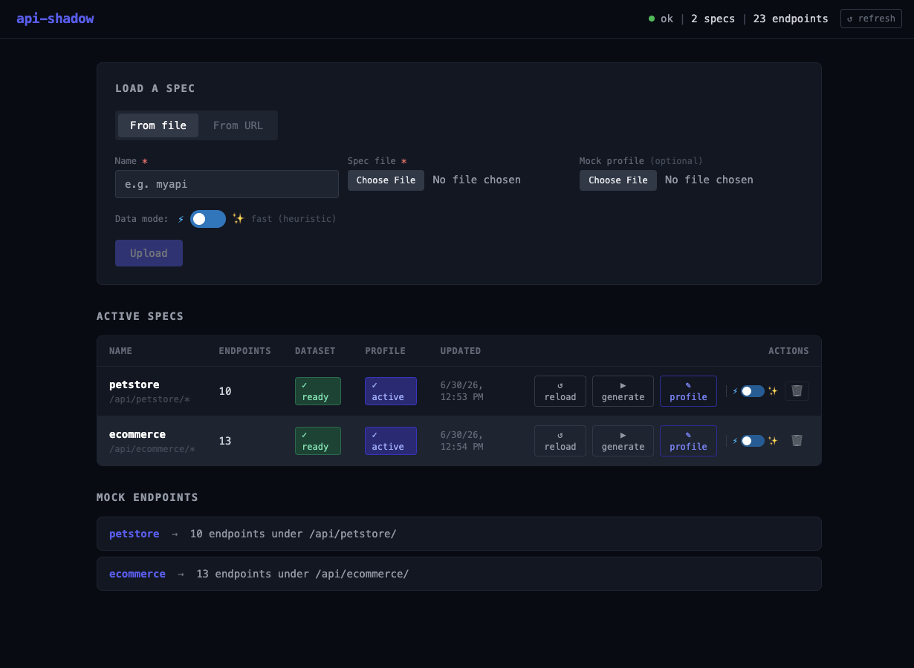
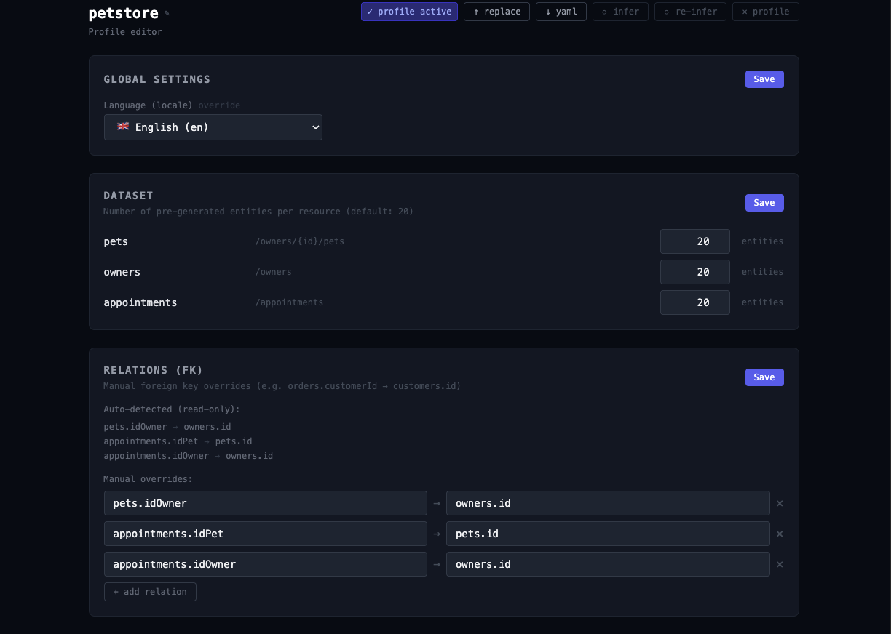
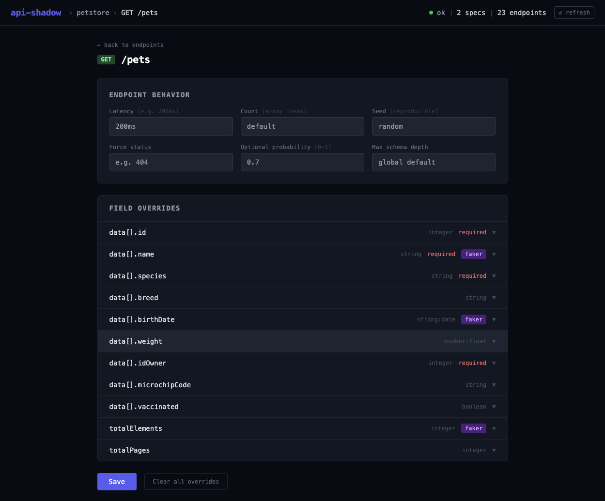

# api-shadow

Mock server that turns an OpenAPI/Swagger spec into working REST endpoints in minutes, serving consistent fake data across all resources.

Useful when you need to develop or test against an API that isn't ready yet, or when you want a realistic mock without hardcoding responses by hand.

## Getting started

**1. Start the server**

```yaml
# docker-compose.yml
services:
  api-shadow:
    image: ghcr.io/skullprogrammer/api-shadow:latest
    ports:
      - "8080:8080"
      - "8090:8090"
    volumes:
      - ./data:/work/data
      - ./models:/work/models
    restart: unless-stopped
```

```bash
docker compose up -d
```

**2. Load your spec**

Open `http://localhost:8080/admin`, click **Upload spec**, and give it a name. Works with OpenAPI 3.x and Swagger 2.x, YAML or JSON, local file or remote URL.

**3. Generate the dataset**

Click **Generate dataset**. api-shadow analyzes the spec, creates a fixed set of entities for each resource (20 by default), and resolves foreign keys between them so the data is consistent — a `GET /orders/42` will always return the same order, and its `customerId` will point to a real customer.

**4. Call the endpoints**

Your endpoints are live at `http://localhost:8080/api/<spec-name>/`. From here you can call them from your frontend, Postman, or wherever.

```bash
curl http://localhost:8080/api/myspec/users
curl http://localhost:8080/api/myspec/users/3
curl http://localhost:8080/api/myspec/users/999   # → 404
```

---

## Admin UI



The admin UI at `/admin` is the main control panel. From there you can:

- **Upload and manage specs** — each spec gets its own namespace; you can have multiple specs loaded at the same time
- **Generate and regenerate the dataset** — choose between fast generation (heuristic FK detection) or semantic generation (uses embeddings to detect relationships by meaning, not just field name patterns)
- **Edit the mock profile** — visual editor for field-level overrides, faker expressions, enum distributions, and fixture responses; changes take effect after regenerating the dataset
- **Browse the resource graph** — shows the detected resources, their relationships, and denormalized fields
- **Inspect endpoints** — per-endpoint schema with field types and faker suggestions





When semantic mode is enabled, field names are matched to faker generators using multilingual embeddings — so `cognome` gets an Italian last name, `prezzo` gets a price, `latitudine` gets a coordinate, without any manual configuration.

---

## Refining the data

After the first run you can tune how data is generated without touching code. Download the auto-generated profile from the admin UI and edit it:

```yaml
locale: it          # faker locale for names, addresses, phone numbers…

dataset:
  users: 50
  orders: 200

relations:
  orders.customerId: users.id   # if not detected automatically

overrides:
  /users/{id}:
    GET:
      fields:
        status:
          enum: [active, suspended]
          distribution: [90, 10]
        email:
          faker: "Internet.emailAddress"

fixtures:
  /auth/token:
    POST:
      static:
        access_token: "mock-token-123"
        expires_in: 3600
```

Upload the modified profile and click **Generate dataset** again.

---

## HTTP behavior

The dataset is read-only — write operations return plausible responses but nothing is actually stored:

| Method | Behavior |
|--------|----------|
| `GET /resource` | Paginated list; `totalElements` and `totalPages` reflect the real dataset size |
| `GET /resource/{id}` | Exact item by ID, 404 if it doesn't exist |
| `POST` | 201 with a random item from the dataset |
| `PUT` | 200 with a random item from the dataset |
| `DELETE` | 204, nothing is removed |

---

## Build from source

Requires Java 21.

```bash
./gradlew quarkusDev        # dev mode with live reload at localhost:8080
./build-image.sh            # build Docker image locally
```

---

## Ports

| Port | |
|------|---|
| 8080 | Mock endpoints + admin UI (`/admin`) |
| 8090 | Swagger UI, health check (`/q/health`) |

---

## License

MIT
